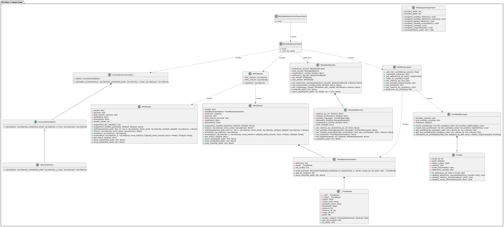

med3pa subpackage
=====================

Overview
---------

The ``med3pa`` subpackage represents a modularized and enhanced version of the original `"MED3PA code" <https://github.com/Olivier998/3PA/tree/dev>`__, 
designed to augment clinical decision-making by providing a robust framework for evaluating and managing **model uncertainty** in healthcare applications. 
It introduces a sophisticated approach to assessing model performance that transcends **traditional global metrics**, 
focusing instead on the concept of predictive confidence at both individual and aggregated levels.

Key Components:
~~~~~~~~~~~~~~~~
- **Individualized Predictive Confidence (IPC)**: This component employs ``regression`` models to estimate the predictive confidence for individual data points. The IPC model, adaptable with various regression algorithms like ``Random Forest``, is particularly aimed at quantifying the uncertainty associated with each prediction, allowing for a detailed analysis of model reliability.

- **Aggregated Predictive Confidence (APC)**: Contrasting with IPC, APC focuses on groups of similar data points, using a ``decision tree regressor`` to analyze uncertainty in aggregated profiles. This method helps identify patterns or groups where the model's performance might be suboptimal, facilitating targeted improvements.

- **Mixed Predictive Confidence (MPC)**: This model combines results from IPC and APC to derive a composite measure of confidence. MPC values are then used to further scrutinize the model's performance and to identify problematic profiles where the base model might fail.

Advanced Analysis with MDR:
~~~~~~~~~~~~~~~~~~~~~~~~~~~
The med3pa approach innovatively employs metrics by declaration rate (MDR), which evaluates model metrics at various confidence thresholds. 
This methodology not only highlights how the model performs across different confidence levels but also **pinpoints specific profiles** (groups of data points) that might be **problematic**. 
By doing so, it aids in the proactive identification and mitigation of potential model failures.

Extensibility for Integration:
~~~~~~~~~~~~~~~~~~~~~~~~~~~~~~
Our package is meticulously designed to facilitate and accommodate **integration** with other methods, such as ``Detectron``. 
This extensibility allows ``med3pa`` to assess shifts in data distributions, **especially focusing on the problematic profiles identified through MPC**. 
Such integration enhances the comprehensive assessment of how external changes or shifts might affect model reliability over time, 
ensuring that the model remains robust and accurate in dynamic clinical environments.

In essence, ``med3pa`` is dedicated to advancing safer clinical deployments by providing tools that not only predict outcomes but also critically analyze and **improve the understanding of where and why predictions might fail.** 
This helps ensure that deployed models are not just effective but are also reliable and trustworthy in real-world settings.

this subpackage includes the following classes:

.. raw:: html

   

uncertainty module
-------------------

.. automodule:: MED3pa.med3pa.uncertainty
   :members:
   :undoc-members:
   :show-inheritance:

models module
---------------------------

.. automodule:: MED3pa.med3pa.models
   :members:
   :undoc-members:
   :show-inheritance:

tree module
-------------------------

.. automodule:: MED3pa.med3pa.tree
   :members:
   :undoc-members:
   :show-inheritance:

Profiles module
-----------------------------

.. automodule:: MED3pa.med3pa.profiles
   :members:
   :undoc-members:
   :show-inheritance:

MDR module
-------------------------------

.. automodule:: MED3pa.med3pa.mdr
   :members:
   :undoc-members:
   :show-inheritance:

experiment module
-------------------------------

.. automodule:: MED3pa.med3pa.experiment
   :members:
   :undoc-members:
   :show-inheritance:

compraison module
-------------------------------

.. automodule:: MED3pa.med3pa.comparaison
   :members:
   :undoc-members:
   :show-inheritance:

