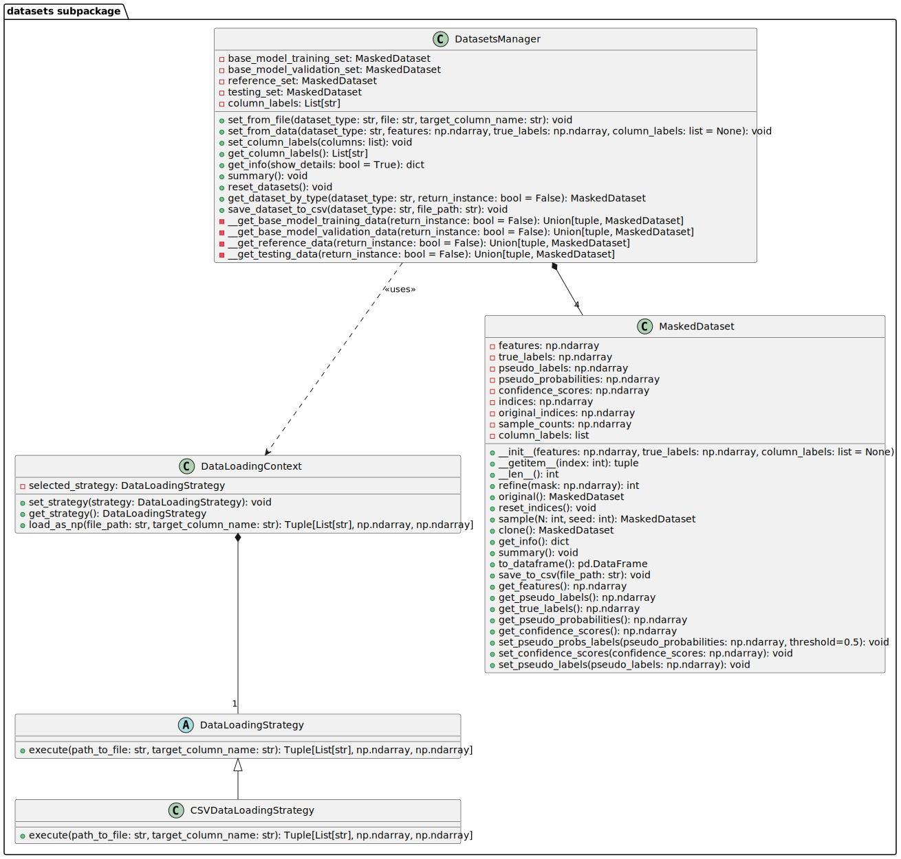

datasets subpackage
=======================
Overview
---------
The ``datasets`` subpackage is a core component designed to manage the complexities of data handling and preparation.
It provides a structured and extensible way to load, process, and manipulate datasets from various sources,
ensuring they are ready for use in machine learning models or data analysis tasks. The subpackage is built to accommodate a variety of data formats and includes functionalities for masking, 
sampling, and managing multiple datasets, making it versatile for different phases of data-driven projects.

This subpackage is composed of the following modules:

- **loading_context**: Manages the strategy for loading data, allowing flexibility in the source file format.
- **loading_strategies**: Implements specific strategies for different file formats.
- **manager**: Coordinates access and manipulations across multiple datasets.

The package includes the following classes:

.. raw:: html

   

**loading\_context module**
---------------------------

.. automodule:: det3pa.datasets.loading_context
   :members:
   :undoc-members:
   :show-inheritance:

**loading\_strategies module**
------------------------------

.. automodule:: det3pa.datasets.loading_strategies
   :members:
   :undoc-members:
   :show-inheritance:

**manager module**
------------------------------

.. automodule:: det3pa.datasets.manager
   :members:
   :undoc-members:
   :show-inheritance:

