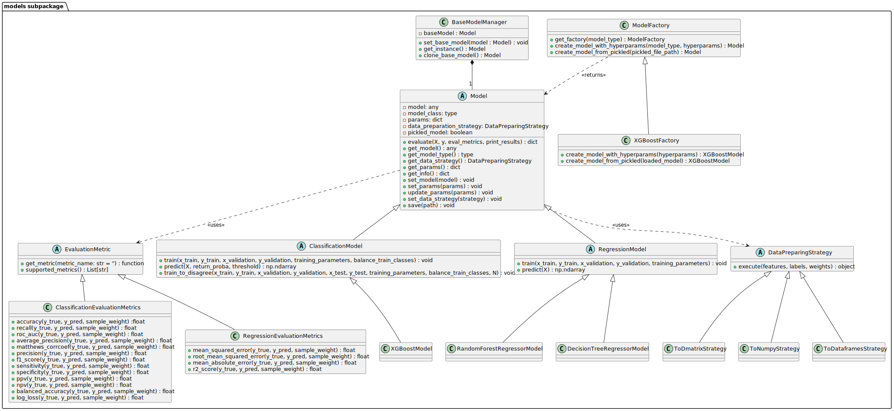

models subpackage
=====================

Overview
----------
The ``models`` subpackage serves as a comprehensive backbone for managing and utilizing machine learning models across various aspects of the package. It is meticulously designed to support the development, evaluation, and optimization of models,
ensuring compatibility and efficiency in integrating with ``med3pa`` and ``Detectron`` methodologies. 
This subpackage leverages several design patterns, such as **Factory, Singleton, and Prototype,** to ensure robustness, modularity, and scalability. 
Through its structured approach, This subpackage offers a robust framework that includes abstract base classes for uniformity in model operations, concrete implementations for specialized algorithms,
and utility tools for precise model evaluation and data handling.

This subpackage is composed of the following modules:

- **factories.py**: Utilizes the factory design pattern to facilitate flexible and scalable model instantiation, enhancing the modularity of model creation.

- **abstract_models.py**: Defines the abstract base classes for all model types, including general models, classification models, and regression models. These classes provide a common interface for model operations.

- **concrete_classifiers.py**: Contains concrete implementations of classification models, like the XGBoostModel.

- **concrete_regressors.py**: Provides implementations for regression models, such as RandomForestRegressor and DecisionTreeRegressor.

- **abstract_metrics.py**: Provides the abstract base classes for all evaluation metrics, centralizing the logic for metric calculations across different model types.

- **classification_metrics.py**: Implements a variety of evaluation metrics specifically for classification tasks, such as accuracy, precision, and recall.

- **regression_metrics.py**: Hosts evaluation metrics for regression tasks, including mean squared error and R2 score, crucial for assessing model performance.

- **data_strategies.py**: Offers various strategies for preparing data, ensuring compatibility and optimal formatting for model training and evaluation.

- **base.py**: Manages a singleton base model, responsible for the instantiation and cloning of the base model across the methods, ensuring consistency and reliability in model management.

The package includes the following classes:

.. raw:: html

   

**factories module**
------------------------------

.. automodule:: MED3pa.models.factories
   :members:
   :undoc-members:
   :show-inheritance:

**abstract\_models module**
-------------------------------------

.. automodule:: MED3pa.models.abstract_models
   :members:
   :undoc-members:
   :show-inheritance:

**concrete\_classifiers module**
------------------------------------------

.. automodule:: MED3pa.models.concrete_classifiers
   :members:
   :undoc-members:
   :show-inheritance:

**concrete\_regressors module**
-----------------------------------------

.. automodule:: MED3pa.models.concrete_regressors
   :members:
   :undoc-members:
   :show-inheritance:

**abstract\_metrics module**
--------------------------------------

.. automodule:: MED3pa.models.abstract_metrics
   :members:
   :undoc-members:
   :show-inheritance:

**classification\_metrics module**
--------------------------------------------

.. automodule:: MED3pa.models.classification_metrics
   :members:
   :undoc-members:
   :show-inheritance:

**regression\_metrics module**
----------------------------------------

.. automodule:: MED3pa.models.regression_metrics
   :members:
   :undoc-members:
   :show-inheritance:

**data\_strategies module**
-------------------------------------

.. automodule:: MED3pa.models.data_strategies
   :members:
   :undoc-members:
   :show-inheritance:

**base module**
-------------------------

.. automodule:: MED3pa.models.base
   :members:
   :undoc-members:
   :show-inheritance:

